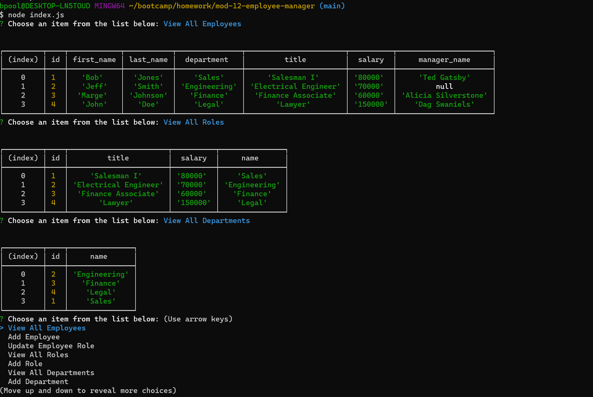

# Employee Manager

## Description
This is an application that allows the user to manage an employee database

## Source Code Used
Source code was provided by bootcamp instructor Gary Almes.  The source code used can be found in the 2nd commit.

## Installation
Navigate to the root directory of the project.  Then type mysql -u root -p(your password).  Then type source ./db/schema.sql, then source ./db/seed.sql.  This will create the database necessary for this project.
    
## Usage
The user is able to:
View All Employees
Add Employee
Update Employee Role
View All Roles
View All Departments
Add Department
    
## Contribution Guidelines
N/A
    
## License
N/A
    
## Email Address
If you have any questions or concerns please reach out to me at bpoole53@gmail.com